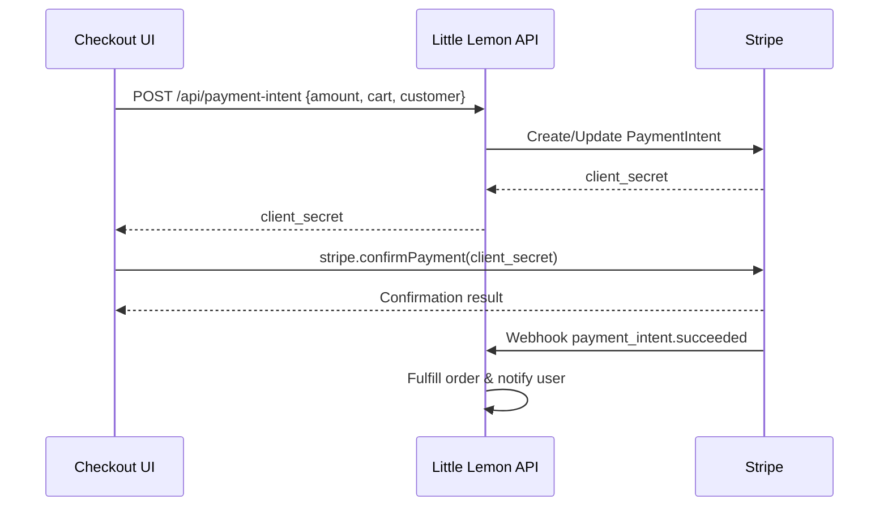

## Purpose

This guide documents the end-to-end Stripe Payment Element integration for the Little Lemon checkout experience. It covers the canonical client and server architecture, security controls, mobile-first UI guidance, and operational checklists required to keep payments resilient and compliant.

## Why the Payment Element

- **Unified UI**: Handles cards, wallets (Apple Pay, Google Pay), Link, and future payment methods without rework.
- **Lowest PCI scope**: Keeps sensitive PAN/CVC data within Stripe-hosted iframes, keeping us in SAQ A.
- **SCA-ready**: Automatically triggers 3D Secure flows through `stripe.confirmPayment`.
- **Mobile-first**: Responsive by default, matching our mobile-first mandate.

## High-Level Architecture

1. **Client (`CheckoutPage.jsx`)** requests a PaymentIntent client secret from our backend once the order total is known.
2. **Backend (Node/Express example)** creates or updates a PaymentIntent using the Stripe secret key with the cart subtotal, tip, taxes, and delivery fees.
3. **Client** initializes Stripe Elements with the received client secret and renders the Payment Element within `CheckoutPaymentStep.tsx`.
4. **Customer confirms payment** via `stripe.confirmPayment`, which handles SCA automatically.
5. **Stripe** sends `payment_intent.succeeded` (or failure) to our webhook endpoint.
6. **Webhook handler** verifies signature, persists the order, and triggers fulfillment workflows.



## Backend Implementation Checklist

- **Dependencies**: `stripe`, `express`, `body-parser`, `helmet`, `cors`, `express-rate-limit`.
- **Environment variables**: Store secrets in deployment platform.
  - `STRIPE_SECRET_KEY`
  - `STRIPE_WEBHOOK_SECRET`
  - `LITTLE_LEMON_BASE_URL`
- **Endpoint: `POST /api/payment-intent`**
  - Validate cart payload, recompute totals server-side to prevent tampering.
  - Require authenticated callers, enforce anti-CSRF tokens on browser submissions, and reject mismatched session/cart owners.
  - Create or update a PaymentIntent with `amount`, `currency`, `customer`, and `automatic_payment_methods: { enabled: true }`.
  - Persist the PaymentIntent ID against the order/cart to reuse on retries and guarantee idempotency.
  - Return `{ clientSecret }`.
- **Webhook: `POST /api/stripe/webhook`**
  - Configure `express.raw({ type: 'application/json' })` middleware on the webhook route before any JSON parser.
  - Verify signature with `stripe.webhooks.constructEvent` using `STRIPE_WEBHOOK_SECRET`.
  - Handle `payment_intent.succeeded`, `payment_intent.payment_failed`, and `charge.refunded`.
  - Persist order, update inventory, trigger notifications.
- **Security middleware**
  - Enforce HTTPS; redirect HTTP to HTTPS in production.
  - Enable HSTS, `helmet` default headers, and strict CORS (only app origin).
  - Add rate limiting and bot detection (e.g., reCAPTCHA) to payment endpoints.
  - Log with correlation IDs; never log raw card data.

### Sample Express Endpoint

```ts
// server/routes/payments.ts
import Stripe from 'stripe';
import type { Request, Response } from 'express';

const stripe = new Stripe(process.env.STRIPE_SECRET_KEY!, { apiVersion: '2024-06-20' });

export const createPaymentIntent = async (req: Request, res: Response) => {
  const { cartId } = req.body;
  const userId = req.user?.id; // populated by auth middleware
  await assertCartOwnership(cartId, userId);

  const order = await loadValidatedOrder(cartId); // server-side calculation
  const existingIntentId = await lookupPaymentIntentId(order.id);

  const intent = existingIntentId
    ? await stripe.paymentIntents.update(existingIntentId, {
        amount: order.totalCents,
        metadata: { orderId: order.id },
      })
    : await stripe.paymentIntents.create(
        {
          amount: order.totalCents,
          currency: 'usd',
          automatic_payment_methods: { enabled: true },
          customer: order.stripeCustomerId,
          metadata: { orderId: order.id },
        },
        { idempotencyKey: order.id }
      );

  await persistPaymentIntentId(order.id, intent.id);
  res.json({ clientSecret: intent.client_secret });
};
```

## Frontend Implementation Checklist

- **Stripe initialization**: `getStripe()` in `src/config/stripe.ts` loads the publishable key from `VITE_STRIPE_PUBLISHABLE_KEY`.
- **Elements provider**: Wrap `CheckoutPage.jsx`’s steps in `<Elements>` with `appearance` tuned for our brand.
- **Fetch client secret**: When `CheckoutPaymentStep.tsx` mounts or totals change, call `/api/payment-intent` and store the `clientSecret` in component state or context.
- **Render Payment Element**:

```tsx
import { PaymentElement } from '@stripe/react-stripe-js';

<PaymentElement options={{ layout: 'tabs', business: { name: 'Little Lemon' } }} />
```

- **Confirm payment**:

```tsx
const handleSubmit = async (event: FormEvent) => {
  event.preventDefault();
  if (!stripe || !elements) return;

  setIsProcessing(true);
  const result = await stripe.confirmPayment({
    elements,
    confirmParams: { return_url: `${window.location.origin}/checkout/success` }
  });
  setIsProcessing(false);

  if (result.error) {
    setCardError(result.error.message ?? 'Payment failed');
    captureClientMetric('stripe_payment_error', { code: result.error.code });
    return;
  } else {
    const status = result.paymentIntent?.status;
    if (status === 'succeeded') {
      navigate('/checkout/review');
    } else if (status === 'processing') {
      setProcessingMessage('Payment is processing. We will email confirmation shortly.');
    } else {
      setCardError('Additional action required. Please retry or use a different method.');
    }
  }
};
```

- **Status messaging**: Maintain local `processingMessage`/`cardError` state and surface them inline so customers receive immediate feedback for `processing`, `requires_action`, or retry scenarios.

- **Responsive layout**: Keep current CSS grid/flex patterns in `CheckoutPaymentStep.module.css`. Stripe Elements auto-adjusts font sizes; pass `fonts` and `appearance.variables` to align with our mobile-first typography system.

## Security Best Practices

- **PCI scope**: Stay in SAQ A by never touching raw card data—only use Stripe-hosted Elements or Checkout.
- **Secrets management**: Rotate keys regularly. Restrict dashboard access with MFA and least privilege roles.
- **TLS everywhere**: Terminate TLS at the edge (Vercel) and ensure API gateway enforces HTTPS (use `helmet.hsts`).
- **Content Security Policy**: Allow Stripe domains (`https://js.stripe.com`, `https://hooks.stripe.com`) in `script-src` and `frame-src`. Deny all direct inline scripts except hashes used by Vite.
  - Include `https://checkout.stripe.com` in `frame-src`/`child-src` and set `frame-ancestors 'self'` to prevent clickjacking.
  - Set a restrictive `Referrer-Policy` (e.g., `strict-origin-when-cross-origin`) to keep metadata out of third-party logs.
- **Webhook verification**: Reject requests without valid signature; respond with 2xx only after successful processing.
- **Idempotency keys**: Use `stripe.paymentIntents.create(..., { idempotencyKey })` or rely on Stripe’s automatic idempotency by reusing PaymentIntent IDs.
- **Fraud tooling**: Enable Stripe Radar default rules; add manual review for high-value orders. Capture additional device signals (e.g., IP, user agent) for anomaly detection.
- **Logging hygiene**: Log PaymentIntent IDs, not PAN/CVC. Redact any user input before storing.
- **Disaster recovery**: Backup webhook signing secret separately. Document emergency key rotation steps.
- **Publishable key handling**: Audit front-end bundles to ensure `VITE_STRIPE_PUBLISHABLE_KEY` reads only from env-vars and never hardcodes fallback values.

## Mobile-First Experience

- **Tap targets**: Ensure buttons like “Save payment method” meet 44px height and have high contrast.
- **Keyboard management**: Auto-scroll `PaymentElement` into view on focus for small screens. Use `inputmode` and `autocomplete` attributes for contact fields.
- **Wallet support**: Enable Apple Pay/Google Pay by completing domain verification and setting `automatic_payment_methods`.
- **Performance**: Lazy-load Payment Step, but prefetch Stripe script using `<link rel="preconnect" href="https://js.stripe.com" />` in the document head.

## Testing & QA

- **Unit tests**: Mock Stripe hooks in `CheckoutPaymentStep.test.tsx` to cover validation and UI states.
- **Integration tests**: Use Stripe CLI `stripe trigger payment_intent.succeeded` to emulate webhook receipts.
- **Manual flows**: Verify card payments (4242 4242 4242 4242), authentication-required payments (4000 0027 6000 3184), and declined cards.
- **Regression**: Run Lighthouse mobile audits to confirm layout stability.
- **Webhook resilience drills**: Simulate webhook replays and delayed deliveries using the Stripe CLI to confirm idempotent order fulfillment logic.

## Monitoring & Incident Response

- **Alerts**: Subscribe to Stripe webhook delivery failure alerts and Stripe Radar notifications.
- **Metrics**: Track PaymentIntent success rate, 3DS completion rate, chargebacks, and refund volume.
- **Runbooks**: Maintain rotation procedures for keys, webhook secret updates, and handling disputed payments.
- **Postmortems**: Log incidents in `docs/logs/` with root cause and mitigation steps.
- **Dead-letter queue**: Persist webhook failures (payload + Stripe signature) for replay after fixes, and alert when backlog grows.

## Deployment Checklist

- [ ] Secrets configured in production environment (Stripe keys, webhook secret).
- [ ] Domains verified for Apple Pay and Google Pay.
- [ ] HTTPS enforced end-to-end.
- [ ] Webhook endpoint deployed with signature verification.
- [ ] Observability dashboards updated with payment metrics.
- [ ] QA sign-off recorded after running Stripe test scenarios.

## References

- Stripe Docs — [Accept a payment](https://docs.stripe.com/payments/accept-a-payment)
- Stripe Docs — [Payment Element best practices](https://docs.stripe.com/payments/payment-element/best-practices)
- Stripe Docs — [Integration security guide](https://docs.stripe.com/security/guide)
- Stripe Docs — [Testing](https://docs.stripe.com/payments/accept-a-payment#test-your-integration)
